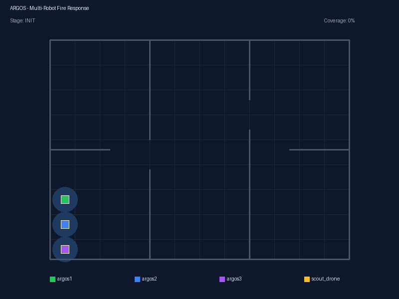

# ARGOS

> **A**utonomous **R**obot **G**roup **O**rchestration **S**ystem


이종 군집 소방 로봇 오케스트레이션 플랫폼.
드론 + UGV(차량형) + 보행형 로봇이 **한 팀**으로 화재 현장을 자율 탐색하고, 화점을 감지하며, 실시간으로 정보를 공유하는 시스템.

현직 소방관이 실제 소방 현장 운영 경험을 바탕으로 설계한 **Supervised Autonomy** 아키텍처 — 오케스트레이터가 "무엇을" 결정하고, 각 로봇이 "어떻게"를 자율 수행합니다.

<p align="center">
  
  <br>
  <em>UGV 3대 + 드론 1대의 자율 탐색 → 화재 감지 → 대응 → 귀환 시나리오</em>
</p>

## Highlights

- **이종 군집 로봇**: UGV 2대 + 드론 1대가 동시에 실내 환경을 탐색
- **자율 프론티어 탐색**: SLAM 맵에서 미탐색 경계를 자동 감지, 최적 프론티어로 이동
- **열화상 화점 감지**: L8 카메라 시뮬레이션 + 적응형 임계값 기반 화점 분류 (low/medium/high/critical)
- **중앙 지휘 시스템**: 오케스트레이터가 로봇 등록, 임무 할당, 긴급 정지, 단계 전환을 관리
- **웹 대시보드**: rosbridge + roslibjs로 브라우저에서 실시간 임무 모니터링
- **소방 시나리오 자동 시연**: 7단계 상태 머신으로 이륙→탐색→화재감지→긴급정지→재개→착륙 자동 실행

## Architecture

```
┌─────────────────────────────────────────────────────┐
│                   Web Dashboard                      │
│     robot trail · click detail · stage timeline      │
│              (rosbridge + roslibjs)                   │
└───────────────────────┬─────────────────────────────┘
                        │ WebSocket :9090
┌───────────────────────┴─────────────────────────────┐
│               Orchestrator Node                      │
│   ┌─────────┬──────────┬──────────┬──────────┐      │
│   │ Robot   │ Mission  │ Fire     │ Emergency│      │
│   │Registry │ Stage    │ Response │ Stop     │      │
│   │         │ Machine  │ Escalate │          │      │
│   └─────────┴──────────┴──────────┴──────────┘      │
│   Deadline QoS 5s · Heartbeat 10s · Fire Expiry 5m  │
└──────┬──────────────┬──────────────┬────────────────┘
       │              │              │
  ┌────┴────┐   ┌─────┴─────┐  ┌────┴─────┐
  │  UGV 1  │   │   UGV 2   │  │  Drone 1 │
  │(argos1) │   │ (argos2)  │  │ (drone1) │
  ├─────────┤   ├───────────┤  ├──────────┤
  │Nav2+SLAM│   │Nav2+SLAM  │  │Waypoint  │
  │Frontier │   │Frontier   │  │P+Yaw     │
  │Explorer │   │Explorer   │  │Controller│
  │Hotspot  │   │Hotspot    │  │          │
  │Detector │   │Detector   │  │          │
  │Status   │   │Status     │  │Status    │
  │Publisher│   │Publisher  │  │Publisher │
  └─────────┘   └───────────┘  └──────────┘
       │              │              │
  ┌────┴──────────────┴──────────────┴────┐
  │          Gazebo Harmonic               │
  │   indoor_test world · ros_gz bridge    │
  └────────────────────────────────────────┘
```

### Node Communication

```
                    /orchestrator/mission_state (MissionState, 2Hz)
                              ▲
                    ┌─────────┴─────────┐
                    │   Orchestrator    │◄──── /orchestrator/emergency_stop (Trigger)
                    │                   │◄──── /orchestrator/resume (Trigger)
                    └──┬──────┬─────┬──┘
                       │      │     │
     robot_status ─────┘      │     └───── fire_alert
     (Deadline QoS 5s)        │            (RELIABLE + TRANSIENT_LOCAL)
                              │
          ┌───────────────────┼───────────────────┐
          │                   │                   │
    ┌─────┴──────┐     ┌─────┴──────┐     ┌──────┴─────┐
    │ RobotStatus│     │ RobotStatus│     │ RobotStatus│
    │  (argos1)  │     │  (argos2)  │     │  (drone1)  │
    └─────┬──────┘     └─────┬──────┘     └──────┬─────┘
          │                  │                    │
    ┌─────┴──────┐     ┌─────┴──────┐     ┌──────┴─────┐
    │ Frontier   │     │ Frontier   │     │   Drone    │
    │ Explorer   │     │ Explorer   │     │ Controller │
    └─────┬──────┘     └─────┬──────┘     └────────────┘
          │                  │
    ┌─────┴──────┐     ┌─────┴──────┐
    │  Hotspot   │     │  Hotspot   │
    │ Detector   │     │ Detector   │
    └────────────┘     └────────────┘
```

### 4-Layer Design

| Layer | Role | Implementation |
|-------|------|----------------|
| **Orchestrator** | 임무 할당, 상황 종합, 전략 판단 | `orchestrator_node.py` |
| **Mission** | 정찰 / 진압보조 / 구조지원 / 위험물 | `scenario_runner_node.py` |
| **Core Services** | 위치추정 · 경로계획 · 군집통신 · 상태관리 | Nav2, slam_toolbox, TF2, ros_gz_bridge |
| **Platform** | Drone / UGV / Legged — 동일 인터페이스 | URDF/SDF + ros2_control |

## Tech Stack

| Component | Technology |
|-----------|-----------|
| ROS | **ROS 2 Jazzy** (Ubuntu 24.04 / WSL2) |
| Simulator | **Gazebo Harmonic** + ros_gz bridge |
| Navigation | **Nav2** (DWB local planner + NavFn global) |
| SLAM | **slam_toolbox** (online async) |
| Drive | **ros2_control** + diff_drive_controller (4WD skid-steer) |
| Drone | Gazebo MulticopterVelocityControl + P controller |
| Vision | Thermal L8 camera (mono8) + OpenCV contour detection |
| Web | **rosbridge_server** + roslibjs (WebSocket) |
| Model | URDF/xacro (3-layer modular: platform/sensors/control) |

## Prerequisites

```bash
# Ubuntu 24.04 (WSL2 or native)
# ROS 2 Jazzy (https://docs.ros.org/en/jazzy/Installation.html)

sudo apt install \
  ros-jazzy-nav2-bringup \
  ros-jazzy-slam-toolbox \
  ros-jazzy-ros-gz \
  ros-jazzy-gz-ros2-control \
  ros-jazzy-controller-manager \
  ros-jazzy-diff-drive-controller \
  ros-jazzy-joint-state-broadcaster \
  ros-jazzy-topic-tools \
  ros-jazzy-rosbridge-server \
  python3-opencv python3-numpy
```

## Quick Start

```bash
# 1. 클론 + 빌드
git clone https://github.com/Jamonnine/argos.git
cd argos/ros2_ws
source /opt/ros/jazzy/setup.bash
colcon build --symlink-install
source install/setup.bash

# 2. 로봇 모델 확인 (RViz)
ros2 launch argos_description display.launch.py

# 3. 단일 로봇 시뮬레이션
ros2 launch argos_description gazebo.launch.py

# 4. 네비게이션 + SLAM + 열화상
ros2 launch argos_description navigation.launch.py

# 5. 자율 프론티어 탐색
ros2 launch argos_description navigation.launch.py explore:=true

# 6. 이종 군집 탐색 (UGV 2 + Drone 1)
ros2 launch argos_description exploration.launch.py

# 7. 전체 소방 시나리오 시연 (rosbridge + 웹 대시보드 포함)
ros2 launch argos_description demo.launch.py
# 별도 터미널에서 웹 서버:
cd $(ros2 pkg prefix argos_description)/share/argos_description/web
python3 -m http.server 8080
# 브라우저: http://localhost:8080
```

### Launch Files

| Launch | Description | Robots |
|--------|-------------|--------|
| `display.launch.py` | RViz에서 URDF 모델 확인 | 1 UGV |
| `gazebo.launch.py` | Gazebo에 로봇 스폰 + 컨트롤러 | 1 UGV |
| `navigation.launch.py` | Nav2 + SLAM + 열화상 + (선택) 프론티어 탐색 | 1 UGV |
| `multi_robot.launch.py` | 멀티로봇 네임스페이스 분리 스폰 | N UGV |
| `exploration.launch.py` | 이종 군집 자율 탐색 + 오케스트레이터 | 2 UGV + 1 Drone |
| `demo.launch.py` | 전체 스택 + 시나리오 러너 + rosbridge | 2 UGV + 1 Drone |
| `monitor.launch.py` | rosbridge 단독 실행 (기존 시뮬에 연결) | — |

## Project Structure

```
argos/
├── ros2_ws/src/
│   ├── argos_description/          # 로봇 모델 + 시뮬레이션 설정
│   │   ├── urdf/                   # URDF/xacro (base + sensors + control)
│   │   ├── models/argos_drone/     # 드론 SDF 모델
│   │   ├── launch/                 # 7개 launch 파일
│   │   ├── config/                 # Nav2 + controllers 파라미터
│   │   ├── worlds/                 # Gazebo indoor_test 월드
│   │   └── web/                    # 웹 대시보드 (index.html)
│   │
│   ├── my_robot_bringup/           # 핵심 노드
│   │   └── my_robot_bringup/
│   │       ├── frontier_explorer_node.py   # 프론티어 자율 탐색
│   │       ├── hotspot_detector_node.py    # 열화상 화점 감지
│   │       ├── orchestrator_node.py        # 중앙 지휘 시스템
│   │       ├── robot_status_node.py        # 상태 보고
│   │       ├── drone_controller_node.py    # 드론 웨이포인트 비행
│   │       ├── scenario_runner_node.py     # 시나리오 자동 실행
│   │       └── perception_bridge_node.py   # AI → Nav2 브릿지
│   │
│   └── my_robot_interfaces/        # 커스텀 메시지/서비스/액션
│       ├── msg/                    # RobotStatus, MissionState, FireAlert, ThermalDetection
│       ├── srv/                    # SetStage, NavigateToObject
│       └── action/                 # PatrolArea
│
├── scripts/                        # 유틸리티 (진단, Gazebo, SLAM, Nav2)
└── docs/                           # 가이드 문서
```

## Nodes

| Node | Description | Key Topics |
|------|-------------|------------|
| `frontier_explorer` | OccupancyGrid 프론티어 감지 → Nav2 자율 이동. 멀티로봇 대상 회피 + 열화상 일시정지. Thread-safe lock | `map` → `navigate_to_pose` |
| `hotspot_detector` | L8 열화상 mono8 적응형 임계값 화점 감지. 프레임당 worst-only + 1초 쿨다운 | `thermal/image_raw` → `thermal/detections` |
| `orchestrator` | 로봇 등록, heartbeat(10s), Deadline QoS(5s), 자동 단계 전환, 화재 에스컬레이션, 배터리 자동귀환 | `/orchestrator/mission_state` |
| `robot_status_publisher` | TF2 위치 + 탐색 상태 + 배터리(시간 감쇠) + 커버리지. TRANSIENT_LOCAL map QoS | `/orchestrator/robot_status` |
| `drone_controller` | P+Yaw 제어기 웨이포인트 비행. 큐 기반 경로. 이륙/착륙/호버링 서비스 | `odom` → `cmd_vel` |
| `scenario_runner` | 7단계 상태 머신 소방 시나리오. 페이즈별 상대 시간 관리 | service clients |
| `perception_bridge` | AI 감지 결과 캐시 → Nav2 목표 변환. 비블로킹 서버 체크 | `/detections` → `navigate_to_pose` |

## Custom Interfaces

```
RobotStatus.msg       — 로봇 상태 (ID, type, state, pose, battery, coverage, capabilities, nav_error_count)
MissionState.msg      — 임무 상태 (stage, robot counts, coverage, fire locations, primary_responder)
FireAlert.msg         — 화점 알림 (robot_id, location, temperature, severity, active)
ThermalDetection.msg  — 열화상 감지 (temperature, bbox, centroid, severity, area_ratio)
PatrolArea.action     — 구역 순찰 (waypoints → progress → result)
SetStage.srv          — 임무 단계 전환
NavigateToObject.srv  — AI 감지 객체로 이동
DetectedObject.msg    — AI 감지 객체 (class, confidence, pose, distance)
```

## Web Dashboard

브라우저에서 실시간 임무 모니터링:

- **미션 패널**: 현재 단계, 경과 시간(MM:SS), 로봇 수, 커버리지
- **스테이지 타임라인**: INIT → EXPL → FIRE → RTN → DONE 진행 표시 (+ PAUSED 오버레이)
- **로봇 테이블**: ID, 타입, 상태, 배터리, 임무, 프론티어 수, nav 에러
- **2D 맵 캔버스**: 로봇 위치(UGV 사각/드론 삼각), 화점 마커, 이동 궤적(trail), 클릭 상세 팝업
- **자동 재연결**: WebSocket 끊김 시 2초 후 자동 재연결 + 재구독

## Milestones

| # | Milestone | Description | Status |
|---|-----------|-------------|--------|
| 1 | PatrolArea Action | Action server/client 기본 구조 | Done |
| 2 | UGV URDF | 3계층 모듈식 xacro (platform/sensors/control) | Done |
| 3 | Nav2 + SLAM | 자율 네비게이션 + 실시간 지도 작성 | Done |
| 4 | Thermal Camera | L8 열화상 시뮬레이션 + 화점 감지 | Done |
| 5 | Multi-Robot | 네임스페이스 분리로 N대 동시 스폰 | Done |
| 6 | Exploration | 프론티어 기반 자율 탐색 (멀티로봇 조율) | Done |
| 7 | Orchestrator | 중앙 지휘 시스템 (Supervised Autonomy) | Done |
| 8 | Drone Platform | 이종 로봇 확장 (UGV + Drone) | Done |
| 9 | Demo Scenario | 소방 시나리오 7단계 자동 시연 | Done |
| 10 | Web Dashboard | rosbridge + roslibjs 실시간 모니터링 | Done |

## Design Decisions

- **Supervised Autonomy** (DARPA SubT CERBERUS 패턴): 오케스트레이터가 할당, 로봇이 자율 실행. 통신 두절 시 독립 수행
- **네임스페이스 분리**: 모든 노드가 상대경로 토픽 사용 → launch에서 `namespace=robot_name`으로 N대 확장
- **적응형 열화상 임계값**: L8 AGC 특성상 고정 임계값 불가 → 상위 N% 적응형 방식
- **페이즈별 상대 시간**: 시나리오 러너가 각 단계의 시작 시점 기준으로 타이밍 관리
- **Deadline QoS**: 로봇 상태 5초 미수신 시 통신 두절 판정 (DDS 표준 품질 보장)
- **화재 에스컬레이션**: 대응 중 더 심각한 화재 감지 시 대응 대상 갱신
- **시간 기반 FireAlert 만료**: 5분 경과 시 자동 비활성화 → 탐색 재개

## References

- DARPA SubT Challenge — CERBERUS, CoSTAR, CSIRO (Supervised Autonomy)
- Open-RMF — Heterogeneous fleet management
- Linorobot2, Husarion Panther — UGV URDF design patterns
- Hyundai HR-Sherpa — Unmanned firefighting robot (100대 확대 추진)
- CMU M-TARE — Multi-robot exploration planner

## Author

**민발** — 대구 강북소방서 소방관 / 1인 개발자
AI·로보틱스 전문 소방관을 지향하며, 현장 경험을 로봇 시스템 설계에 반영합니다.

## License

Apache-2.0
